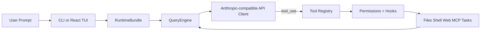

<h1 align="center">
  
  &nbsp;&nbsp;
  
  <br>
  <code>oh</code> — OpenHarness &amp; <code>ohmo</code>
</h1>

<p align="center">
  <a href="README.md"><strong>English</strong></a> ·
  <a href="README.zh-CN.md"><strong>简体中文</strong></a>
</p>

**OpenHarness** delivers core lightweight agent infrastructure: tool-use, skills, memory, and multi-agent coordination.

**ohmo** is a personal AI agent built on OpenHarness — not another chatbot, but an assistant that actually works for you over long sessions. Chat with ohmo in Feishu / Slack / Telegram / Discord, and it forks branches, writes code, runs tests, and opens PRs on its own. ohmo runs on your existing Claude Code or Codex subscription — no extra API key needed.

**Join the community**: contribute **Harness** for open agent development.

<p align="center">
  <a href="#-quick-start"></a>
  <a href="#-harness-architecture"></a>
  <a href="#-features"></a>
  <a href="#-test-results"></a>
  <a href="LICENSE"></a>
</p>

<p align="center">
  
  
  
  
  
  <a href="https://github.com/HKUDS/OpenHarness/actions/workflows/ci.yml"></a>
  <a href="https://github.com/HKUDS/.github/blob/main/profile/README.md"></a>
  <a href="https://github.com/HKUDS/.github/blob/main/profile/README.md"></a>
</p>

One Command (**oh**) to Launch **OpenHarness** and Unlock All Agent Harnesses. 

Supports CLI agent integration including OpenClaw, nanobot, Cursor, and more.

<p align="center">
  
</p>

---
## ✨ OpenHarness's Key Harness Features

<table align="center" width="100%">
<tr>
<td width="20%" align="center" style="vertical-align: top; padding: 15px;">

<h3>🔄 Agent Loop</h3>

<div align="center">
  
</div>


<p align="center"><strong>• Streaming Tool-Call Cycle</strong></p>
<p align="center"><strong>• API Retry with Exponential Backoff</strong></p>
<p align="center"><strong>• Parallel Tool Execution</strong></p>
<p align="center"><strong>• Token Counting & Cost Tracking</strong></p>

</td>
<td width="20%" align="center" style="vertical-align: top; padding: 15px;">

<h3>🔧 Harness Toolkit</h3>

<div align="center">
  
</div>


<p align="center"><strong>• 43 Tools (File, Shell, Search, Web, MCP)</strong></p>
<p align="center"><strong>• On-Demand Skill Loading (.md)</strong></p>
<p align="center"><strong>• Plugin Ecosystem (Skills + Hooks + Agents)</strong></p>
<p align="center"><strong>• Compatible with anthropics/skills & plugins</strong></p>

</td>
<td width="20%" align="center" style="vertical-align: top; padding: 15px;">

<h3>🧠 Context & Memory</h3>

<div align="center">
  
</div>


<p align="center"><strong>• CLAUDE.md Discovery & Injection</strong></p>
<p align="center"><strong>• Context Compression (Auto-Compact)</strong></p>
<p align="center"><strong>• MEMORY.md Persistent Memory</strong></p>
<p align="center"><strong>• Session Resume & History</strong></p>

</td>
<td width="20%" align="center" style="vertical-align: top; padding: 15px;">

<h3>🛡️ Governance</h3>

<div align="center">
  
</div>


<p align="center"><strong>• Multi-Level Permission Modes</strong></p>
<p align="center"><strong>• Path-Level & Command Rules</strong></p>
<p align="center"><strong>• PreToolUse / PostToolUse Hooks</strong></p>
<p align="center"><strong>• Interactive Approval Dialogs</strong></p>

</td>
<td width="20%" align="center" style="vertical-align: top; padding: 15px;">

<h3>🤝 Swarm Coordination</h3>

<div align="center">
  
</div>


<p align="center"><strong>• Subagent Spawning & Delegation</strong></p>
<p align="center"><strong>• Team Registry & Task Management</strong></p>
<p align="center"><strong>• Background Task Lifecycle</strong></p>
<p align="center"><strong>• <a href="https://github.com/HKUDS/ClawTeam">ClawTeam</a> Integration (Roadmap)</strong></p>

</td>
</tr>
</table>

---

## 🤔 What is an Agent Harness?

An **Agent Harness** is the complete infrastructure that wraps around an LLM to make it a functional agent. The model provides intelligence; the harness provides **hands, eyes, memory, and safety boundaries**.

<p align="center">
  
</p>

OpenHarness is an open-source Python implementation designed for **researchers, builders, and the community**:

- **Understand** how production AI agents work under the hood
- **Experiment** with cutting-edge tools, skills, and agent coordination patterns
- **Extend** the harness with custom plugins, providers, and domain knowledge
- **Build** specialized agents on top of proven architecture

---

## 📰 What's New

- **Unreleased** 🔍 **Dry-run safe preview**:
  - `oh --dry-run` previews resolved runtime settings, auth state, skills, commands, tools, and configured MCP servers without executing the model, tools, or subagents.
  - Dry-run now reports a `ready` / `warning` / `blocked` readiness verdict with concrete next-step suggestions such as fixing auth, fixing MCP config, or running the prompt directly.
  - Prompt previews include likely matching skills and tools, while slash-command previews show whether the command is mostly read-only or stateful.
- **2026-04-18** ⚙️ **v0.1.7** — Packaging & TUI polish:
  - Install script now links `oh`, `ohmo`, and `openharness` into `~/.local/bin` instead of prepending the virtualenv `bin` directory to `PATH`, which avoids clobbering Conda-managed shells.
  - React TUI now supports `Shift+Enter` to insert a newline while keeping plain `Enter` as submit.
  - Busy-state animation in the React TUI is quieter and less error-prone on Windows terminals, with conservative spinner frames and reduced flashing.
- **2026-04-10** 🧠 **v0.1.6** — Auto-Compaction & Markdown TUI:
  - Auto-Compaction preserves task state and channel logs across context compression — agents can run multi-day sessions without manual compact/clear
  - Subprocess teammates run in headless worker mode; agent team creation stabilized
  - Assistant messages now render full Markdown in the React TUI
  - `ohmo` gains channel slash commands and multimodal attachment support
- **2026-04-08** 🔌 **v0.1.5** — MCP HTTP transport & Swarm polling:
  - MCP protocol adds HTTP transport, auto-reconnect on disconnect, and tool-only server compatibility
  - JSON Schema types inferred for MCP tool inputs — no manual type mapping needed
  - `ohmo` channels support file attachments and multimodal gateway messages
  - Subprocess agents are now pollable in real runs; permission modals serialized to prevent input swallowing
- **2026-04-08** 🌙 **v0.1.4** — Multi-provider auth & Moonshot/Kimi:
  - Native Moonshot/Kimi provider with `reasoning_content` support for thinking models
  - Auth overhaul: fixed provider-switching key mismatch, `OPENAI_BASE_URL` env override, profile-scoped credential priority
  - MCP gracefully handles disconnected servers in `call_tool` / `read_resource`
  - Security: built-in sensitive-path protection in PermissionChecker, hardened `web_fetch` URL validation
  - Stability: EIO crash recovery in Ink TUI, `--debug` logging, Windows cmd flash fix
- **2026-04-06** 🚀 **v0.1.2** — Unified setup flows and `ohmo` personal-agent app:
  - `oh setup` now guides provider selection as workflows instead of exposing raw auth/provider internals
  - Compatible API setup is now profile-scoped, so Anthropic/OpenAI-compatible endpoints can keep separate keys
  - `ohmo` ships as a packaged app with `~/.ohmo` workspace, gateway, bootstrap prompts, and channel config flow
- **2026-04-01** 🎨 **v0.1.0** — Initial **OpenHarness** open-source release featuring complete Harness architecture: 

<p align="center">
  <strong>Start here:</strong>
  <a href="#-quick-start">Quick Start</a> ·
  <a href="#-provider-compatibility">Provider Compatibility</a> ·
  <a href="docs/SHOWCASE.md">Showcase</a> ·
  <a href="CONTRIBUTING.md">Contributing</a> ·
  <a href="CHANGELOG.md">Changelog</a>
</p>

---

## 📈 Incremental Improvements

OpenHarness evolves through **small, frequent, layered releases** — each version adds a focused set of capabilities while preserving backward compatibility. This incremental approach ensures the harness stays stable and predictable while steadily expanding its feature surface.

### Release Cadence & Philosophy

- **Rapid iteration**: v0.1.0 through v0.1.7 shipped over ~18 days, each release targeting a specific subsystem (auth, MCP transport, TUI, compaction, packaging).
- **Layered architecture**: New capabilities are added as composable layers — the agent loop, tool registry, permission system, and MCP client are independently upgradeable.
- **Safe defaults**: Every release preserves existing behavior; breaking changes are rare and always documented.
- **Community-driven**: Features are prioritized by real usage patterns from the open-source community and downstream integrators.

### Key Improvement Themes

| Theme | Releases | What improved |
|-------|----------|---------------|
| **Provider Ecosystem** | v0.1.2, v0.1.4 | Multi-provider auth, Moonshot/Kimi support, compatible API profiles, Copilot OAuth |
| **Agent Reliability** | v0.1.0, v0.1.6 | Exponential backoff retry, auto-compaction for long sessions, session resume |
| **Tool & Protocol Surface** | v0.1.0, v0.1.5 | 43+ tools, MCP HTTP transport, auto-reconnect, JSON Schema type inference |
| **UX & Observability** | v0.1.7, v0.1.8 | React/Ink TUI polish, Markdown rendering, dry-run preview, readiness verdicts |
| **Multi-Agent** | v0.1.5, v0.1.6 | Subprocess teammates, background task polling, team lifecycle management |
| **Safety** | v0.1.4 | Sensitive-path protection, hardened URL validation, permission serialization |

Each release's full details are tracked in [`CHANGELOG.md`](CHANGELOG.md) and the per-release notes (`RELEASE_NOTES_v*.md`).

---
## 🚀 Quick Start

### 1. Install

#### Linux / macOS / WSL

```bash
# One-click install
curl -fsSL https://raw.githubusercontent.com/HKUDS/OpenHarness/main/scripts/install.sh | bash

# Or via pip
pip install openharness-ai
```

#### Windows (Native)

```powershell
# One-click install (PowerShell)
iex (Invoke-WebRequest -Uri 'https://raw.githubusercontent.com/HKUDS/OpenHarness/main/scripts/install.ps1')

# Or via pip
pip install openharness-ai
```

**Note**: Windows support is now native. In PowerShell, use `openh` instead of `oh` because `oh` can resolve to the built-in `Out-Host` alias.

### 2. Configure

```bash
oh setup    # interactive wizard — pick a provider, authenticate, done
# On Windows PowerShell, use: openh setup
```

Supports **Claude / OpenAI / Copilot / Codex / Moonshot(Kimi) / GLM / MiniMax / NVIDIA NIM** and any compatible endpoint.

### 3. Run

```bash
oh
# On Windows PowerShell, use: openh
```

<p align="center">
  
</p>

### 4. Set up ohmo (Personal Agent)

Want an AI agent that works for you from Feishu / Slack / Telegram / Discord?

```bash
ohmo init             # initialize ~/.ohmo workspace
ohmo config           # configure channels and provider
ohmo gateway start    # start the gateway — ohmo is now live in your chat app
```

ohmo runs on your existing **Claude Code subscription** or **Codex subscription** — no extra API key needed.

### Non-Interactive Mode (Pipes & Scripts)

```bash
# Single prompt → stdout
oh -p "Explain this codebase"

# JSON output for programmatic use
oh -p "List all functions in main.py" --output-format json

# Stream JSON events in real-time
oh -p "Fix the bug" --output-format stream-json
```

### Dry Run (Safe Preview)

Use `--dry-run` when you want to inspect what OpenHarness would use before any live execution starts.

```bash
# Preview an interactive session setup
oh --dry-run

# Preview one prompt without executing the model or tools
oh --dry-run -p "Review this bug fix and grep for failing tests"

# Preview a slash command path
oh --dry-run -p "/plugin list"

# Get structured output for scripts or channels
oh --dry-run -p "Explain this repository" --output-format json
```

Dry-run is intentionally static:

- It does **not** call the model
- It does **not** execute tools or spawn subagents
- It does **not** connect to MCP servers
- It **does** resolve settings, auth status, prompt assembly, skills, commands, tools, and obvious MCP config problems

Readiness levels:

- `ready`: configuration looks usable; the next suggested action is usually to run the prompt directly
- `warning`: OpenHarness can resolve the session, but something important still looks wrong, such as broken MCP config or missing auth for later model work
- `blocked`: the requested path will not run successfully as-is, for example an unknown slash command or a prompt that cannot resolve a runtime client

`next actions` in the dry-run output tell you the shortest fix or follow-up step, such as:

- run `oh auth login`
- fix or disable broken MCP configuration
- run the prompt directly with `oh -p "..."` or open the interactive UI with `oh`

## 🏃 How to Run the Harness

OpenHarness provides multiple ways to interact with the agent infrastructure, from interactive terminal UI to headless scripting.

### Interactive Mode (Default)

```bash
oh          # Launch the interactive React/Ink TUI
```

The TUI provides a full interactive experience: type prompts, use slash commands (`/help`, `/plan`, `/resume`), approve or deny tool-use permissions in real-time, and switch modes on the fly.

### Headless / Scripting Mode

```bash
# Single prompt → stdout (ideal for scripts and CI)
oh -p "Explain the architecture of this codebase"

# JSON output for programmatic consumption
oh -p "List all functions in main.py" --output-format json

# Stream JSON events in real-time (ideal for channels / gateways)
oh -p "Fix the bug in parser.py" --output-format stream-json
```

### Pipe Mode

```bash
# Feed context from stdin
echo "What does this error mean?" | oh
cat error.log | oh -p "Diagnose this stack trace and suggest a fix"
```

### Resuming Sessions

```bash
oh --resume        # Pick a previous session from the history list
oh -c              # Continue the most recent session
oh -n my-session   # Start a named session for later resumption
```

### Model & Behavior Tuning

```bash
oh -m claude-sonnet-4-6          # Use a specific model
oh --max-turns 50                # Limit agent loop iterations
oh --effort high                 # Set reasoning effort (for thinking models)
oh -s "You are a security auditor."  # Override the system prompt
oh --append-system-prompt "Always write tests first."
```

### Permission Modes

```bash
oh --permission-mode auto         # Allow all tool calls without prompts
oh --permission-mode plan          # Block all write operations (review-first)
oh --dangerously-skip-permissions  # Bypass all permission checks (sandbox only)
```

### Advanced Flags

```bash
oh -d / --debug                   # Verbose diagnostic output
oh --bare                         # Minimal output (no TUI, no formatting)
oh --settings path/to/settings.json  # Use a custom settings file
oh --mcp-config path/to/mcp.json     # Use a custom MCP server config
```

---
## 🔌 Provider Compatibility

OpenHarness treats providers as **workflows** backed by named profiles. In day-to-day use, prefer:

```bash
oh setup
oh provider list
oh provider use <profile>
```

### Built-in Workflows

| Workflow | What it is | Typical backends |
|----------|------------|------------------|
| **Anthropic-Compatible API** | Anthropic-style request format | Claude official, Kimi, GLM, MiniMax, internal Anthropic-compatible gateways |
| **Claude Subscription** | Claude CLI subscription bridge | Local `~/.claude/.credentials.json` |
| **OpenAI-Compatible API** | OpenAI-style request format | OpenAI official, OpenRouter, DashScope, DeepSeek, SiliconFlow, Groq, Ollama, GitHub Models |
| **Codex Subscription** | Codex CLI subscription bridge | Local `~/.codex/auth.json` |
| **GitHub Copilot** | Copilot OAuth workflow | GitHub Copilot device-flow login |

### Compatible API Families

#### Anthropic-Compatible API

Typical examples:

| Backend | Base URL | Example models |
|---------|----------|----------------|
| **Claude official** | `https://api.anthropic.com` | `claude-sonnet-4-6`, `claude-opus-4-6` |
| **Moonshot / Kimi** | `https://api.moonshot.cn/anthropic` | `kimi-k2.5` |
| **Zhipu / GLM** | custom Anthropic-compatible endpoint | `glm-4.5` |
| **MiniMax** | custom Anthropic-compatible endpoint | `minimax-m1` |

#### OpenAI-Compatible API

Any provider implementing the OpenAI `/v1/chat/completions` style API works:

| Backend | Base URL | Example models |
|---------|----------|----------------|
| **OpenAI** | `https://api.openai.com/v1` | `gpt-5.4`, `gpt-4.1` |
| **OpenRouter** | `https://openrouter.ai/api/v1` | provider-specific |
| **Alibaba DashScope** | `https://dashscope.aliyuncs.com/compatible-mode/v1` | `qwen3.5-flash`, `qwen3-max`, `deepseek-r1` |
| **DeepSeek** | `https://api.deepseek.com` | `deepseek-chat`, `deepseek-reasoner` |
| **GitHub Models** | `https://models.inference.ai.azure.com` | `gpt-4o`, `Meta-Llama-3.1-405B-Instruct` |
| **SiliconFlow** | `https://api.siliconflow.cn/v1` | `deepseek-ai/DeepSeek-V3` |
| **NVIDIA NIM** | `https://integrate.api.nvidia.com/v1` | `openai/gpt-oss-120b`, `nvidia/llama-3.3-nemotron-super-49b-v1` |
| **Google Gemini** | `https://generativelanguage.googleapis.com/v1beta/openai` | `gemini-2.5-flash`, `gemini-2.5-pro` |
| **Groq** | `https://api.groq.com/openai/v1` | `llama-3.3-70b-versatile` |
| **Ollama (local)** | `http://localhost:11434/v1` | any local model |

### Advanced Profile Management

```bash
# List saved workflows
oh provider list

# Switch the active workflow
oh provider use codex

# Add your own compatible endpoint
oh provider add my-endpoint \
  --label "My Endpoint" \
  --provider openai \
  --api-format openai \
  --auth-source openai_api_key \
  --model my-model \
  --base-url https://example.com/v1
```

For custom compatible endpoints, OpenHarness can bind credentials per profile instead of forcing every Anthropic-compatible or OpenAI-compatible backend to share the same API key.

### Ollama (Local Models)

Run local models through Ollama's OpenAI-compatible endpoint:

```bash
# Add an Ollama provider profile
oh provider add ollama \
  --label "Ollama" \
  --provider Ollama \
  --api-format openai \
  --auth-source openai_api_key \
  --model glm-4.7-flash:q8_0 \
  --base-url http://localhost:11434/v1
```
```
Saved provider profile: ollama
```

```bash
# Activate and verify
oh provider use ollama
```
```
Activated provider profile: ollama
```

```bash
oh provider list
```
```
  claude-api: Anthropic-Compatible API [ready]
  ...
  moonshot: Moonshot (Kimi) [missing auth]
    auth=moonshot_api_key model=kimi-k2.5 base_url=https://api.moonshot.cn/v1
* ollama: Ollama [ready]
    auth=openai_api_key model=glm-4.7-flash:q8_0 base_url=http://localhost:11434/v1
```

### GitHub Copilot Format (`--api-format copilot`)

Use your existing GitHub Copilot subscription as the LLM backend. Authentication uses GitHub's OAuth device flow — no API keys needed.

```bash
# One-time login (opens browser for GitHub authorization)
oh auth copilot-login

# Then launch with Copilot as the provider
uv run oh --api-format copilot

# Or via environment variable
export OPENHARNESS_API_FORMAT=copilot
uv run oh

# Check auth status
oh auth status

# Remove stored credentials
oh auth copilot-logout
```

| Feature | Details |
|---------|---------|
| **Auth method** | GitHub OAuth device flow (no API key needed) |
| **Token management** | Automatic refresh of short-lived session tokens |
| **Enterprise** | Supports GitHub Enterprise via `--github-domain` flag |
| **Models** | Uses Copilot's default model selection |
| **API** | OpenAI-compatible chat completions under the hood |

---

## 🏗️ Harness Architecture

OpenHarness implements the core Agent Harness pattern with 10 subsystems:

```
openharness/
  engine/          # 🧠 Agent Loop — query → stream → tool-call → loop
  tools/           # 🔧 43 Tools — file I/O, shell, search, web, MCP
  skills/          # 📚 Knowledge — on-demand skill loading (.md files)
  plugins/         # 🔌 Extensions — commands, hooks, agents, MCP servers
  permissions/     # 🛡️ Safety — multi-level modes, path rules, command deny
  hooks/           # ⚡ Lifecycle — PreToolUse/PostToolUse event hooks
  commands/        # 💬 54 Commands — /help, /commit, /plan, /resume, ...
  mcp/             # 🌐 MCP — Model Context Protocol client
  memory/          # 🧠 Memory — persistent cross-session knowledge
  tasks/           # 📋 Tasks — background task management
  coordinator/     # 🤝 Multi-Agent — subagent spawning, team coordination
  prompts/         # 📝 Context — system prompt assembly, CLAUDE.md, skills
  config/          # ⚙️ Settings — multi-layer config, migrations
  ui/              # 🖥️ React TUI — backend protocol + frontend
```

### The Agent Loop

The heart of the harness. One loop, endlessly composable:

```python
while True:
    response = await api.stream(messages, tools)
    
    if response.stop_reason != "tool_use":
        break  # Model is done
    
    for tool_call in response.tool_uses:
        # Permission check → Hook → Execute → Hook → Result
        result = await harness.execute_tool(tool_call)
    
    messages.append(tool_results)
    # Loop continues — model sees results, decides next action
```

The model decides **what** to do. The harness handles **how** — safely, efficiently, with full observability.

### Harness Flow



---

## ✨ Features

### 🔧 Tools (43+)

| Category | Tools | Description |
|----------|-------|-------------|
| **File I/O** | Bash, Read, Write, Edit, Glob, Grep | Core file operations with permission checks |
| **Search** | WebFetch, WebSearch, ToolSearch, LSP | Web and code search capabilities |
| **Notebook** | NotebookEdit | Jupyter notebook cell editing |
| **Agent** | Agent, SendMessage, TeamCreate/Delete | Subagent spawning and coordination |
| **Task** | TaskCreate/Get/List/Update/Stop/Output | Background task management |
| **MCP** | MCPTool, ListMcpResources, ReadMcpResource | Model Context Protocol integration |
| **Mode** | EnterPlanMode, ExitPlanMode, Worktree | Workflow mode switching |
| **Schedule** | CronCreate/List/Delete, RemoteTrigger | Scheduled and remote execution |
| **Meta** | Skill, Config, Brief, Sleep, AskUser | Knowledge loading, configuration, interaction |

Every tool has:
- **Pydantic input validation** — structured, type-safe inputs
- **Self-describing JSON Schema** — models understand tools automatically
- **Permission integration** — checked before every execution
- **Hook support** — PreToolUse/PostToolUse lifecycle events

### 📚 Skills System

Skills are **on-demand knowledge** — loaded only when the model needs them:

```
Available Skills:
- commit: Create clean, well-structured git commits
- review: Review code for bugs, security issues, and quality
- debug: Diagnose and fix bugs systematically
- plan: Design an implementation plan before coding
- test: Write and run tests for code
- simplify: Refactor code to be simpler and more maintainable
- pdf: PDF processing with pypdf (from anthropics/skills)
- xlsx: Excel operations (from anthropics/skills)
- ... 40+ more
```

Skills can live in bundled, user, ohmo, project, or plugin locations. User-level skills are loaded from:

```text
~/.openharness/skills/<skill>/SKILL.md
~/.claude/skills/<skill>/SKILL.md
~/.agents/skills/<skill>/SKILL.md
```

Project-level skills are enabled by default and are discovered from the current working directory up to the git root:

```text
<project>/.openharness/skills/<skill>/SKILL.md
<project>/.agents/skills/<skill>/SKILL.md
<project>/.claude/skills/<skill>/SKILL.md
```

Disable project skills for untrusted repositories with:

```bash
oh config set allow_project_skills false
```

Use `/skills` to list loaded skills with their source and path. User-invocable skills can be run directly as slash commands, for example `/deploy staging`.

**Compatible with [anthropics/skills](https://github.com/anthropics/skills)** — use the `SKILL.md` directory layout above.

### 🔌 Plugin System

**Compatible with [claude-code plugins](https://github.com/anthropics/claude-code/tree/main/plugins)**. Tested with 12 official plugins:

| Plugin | Type | What it does |
|--------|------|-------------|
| `commit-commands` | Commands | Git commit, push, PR workflows |
| `security-guidance` | Hooks | Security warnings on file edits |
| `hookify` | Commands + Agents | Create custom behavior hooks |
| `feature-dev` | Commands | Feature development workflow |
| `code-review` | Agents | Multi-agent PR review |
| `pr-review-toolkit` | Agents | Specialized PR review agents |

```bash
# Manage plugins
oh plugin list
oh plugin install <source>
oh plugin enable <name>
```

### 🤝 Ecosystem Workflows

OpenHarness is useful as a lightweight harness layer around Claude-style tooling conventions:

- **OpenClaw-oriented workflows** can reuse Markdown-first knowledge and command-driven collaboration patterns.
- **Claude-style plugins and skills** stay portable because OpenHarness keeps those formats familiar.
- **ClawTeam-style multi-agent work** maps well onto the built-in team, task, and background execution primitives.

For concrete usage ideas instead of generic claims, see [`docs/SHOWCASE.md`](docs/SHOWCASE.md).

### 🛡️ Permissions

Multi-level safety with fine-grained control:

| Mode | Behavior | Use Case |
|------|----------|----------|
| **Default** | Ask before write/execute | Daily development |
| **Auto** | Allow everything | Sandboxed environments |
| **Plan Mode** | Block all writes | Large refactors, review first |

**Path-level rules** in `settings.json`:
```json
{
  "permission": {
    "mode": "default",
    "path_rules": [{"pattern": "/etc/*", "allow": false}],
    "denied_commands": ["rm -rf /", "DROP TABLE *"]
  }
}
```

### 🖥️ Terminal UI

React/Ink TUI with full interactive experience:

- **Command picker**: Type `/` → arrow keys to select → Enter
- **Permission dialog**: Interactive y/n with tool details
- **Mode switcher**: `/permissions` → select from list
- **Session resume**: `/resume` → pick from history
- **Animated spinner**: Real-time feedback during tool execution
- **Keyboard shortcuts**: Shown at the bottom, context-aware

### 📡 CLI

```
oh [OPTIONS] COMMAND [ARGS]

Session:     -c/--continue, -r/--resume, -n/--name
Model:       -m/--model, --effort, --max-turns
Output:      -p/--print, --output-format text|json|stream-json
Permissions: --permission-mode, --dangerously-skip-permissions
Context:     -s/--system-prompt, --append-system-prompt, --settings
Advanced:    -d/--debug, --mcp-config, --bare

Subcommands: oh setup | oh provider | oh auth | oh mcp | oh plugin
```

### 🧑‍💼 ohmo Personal Agent

`ohmo` is a personal-agent app built on top of OpenHarness. It is packaged alongside `oh`, with its own workspace and gateway:

```bash
# Initialize personal workspace
ohmo init

# Configure gateway channels and pick a provider profile
ohmo config

# Run the personal agent
ohmo

# Run the gateway in foreground
ohmo gateway run

# Check or restart the gateway
ohmo gateway status
ohmo gateway restart
```

Key concepts:

- `~/.ohmo/`
  - personal workspace root
- `soul.md`
  - long-term agent personality and behavior
- `identity.md`
  - who `ohmo` is
- `user.md`
  - user profile and preferences
- `BOOTSTRAP.md`
  - first-run landing ritual
- `memory/`
  - personal memory
- `gateway.json`
  - selected provider profile and channel configuration

`ohmo config` uses the same workflow language as `oh setup`, so you can point the personal-agent gateway at:

- `Anthropic-Compatible API`
- `Claude Subscription`
- `OpenAI-Compatible API`
- `Codex Subscription`
- `GitHub Copilot`

`ohmo init` creates the home workspace once. After that, use `ohmo config` to update provider and channel settings; if the gateway is already running, the config flow can restart it for you.

Currently `ohmo init` / `ohmo config` can guide channel setup for:

- Telegram
- Slack
- Discord
- Feishu

---

## 📊 Test Results

| Suite | Tests | Status |
|-------|-------|--------|
| Unit + Integration | 114 | ✅ All passing |
| CLI Flags E2E | 6 | ✅ Real model calls |
| Harness Features E2E | 9 | ✅ Retry, skills, parallel, permissions |
| React TUI E2E | 3 | ✅ Welcome, conversation, status |
| TUI Interactions E2E | 4 | ✅ Commands, permissions, shortcuts |
| Real Skills + Plugins | 12 | ✅ anthropics/skills + claude-code/plugins |

```bash
# Run all tests
uv run pytest -q                           # 114 unit/integration
python scripts/test_harness_features.py     # Harness E2E
python scripts/test_real_skills_plugins.py  # Real plugins E2E
```

---

## 🔧 Extending OpenHarness

### Add a Custom Tool

```python
from pydantic import BaseModel, Field
from openharness.tools.base import BaseTool, ToolExecutionContext, ToolResult

class MyToolInput(BaseModel):
    query: str = Field(description="Search query")

class MyTool(BaseTool):
    name = "my_tool"
    description = "Does something useful"
    input_model = MyToolInput

    async def execute(self, arguments: MyToolInput, context: ToolExecutionContext) -> ToolResult:
        return ToolResult(output=f"Result for: {arguments.query}")
```

### Add a Custom Skill

Create `~/.openharness/skills/my-skill.md`:

```markdown
---
name: my-skill
description: Expert guidance for my specific domain
---

# My Skill

## When to use
Use when the user asks about [your domain].

## Workflow
1. Step one
2. Step two
...
```

### Add a Plugin

Create `.openharness/plugins/my-plugin/.claude-plugin/plugin.json`:

```json
{
  "name": "my-plugin",
  "version": "1.0.0",
  "description": "My custom plugin"
}
```

Add commands in `commands/*.md`, hooks in `hooks/hooks.json`, agents in `agents/*.md`.

---

## 🌍 Showcase

OpenHarness is most useful when treated as a small, inspectable harness you can adapt to a real workflow:

- **Repo coding assistant** for reading code, patching files, and running checks locally.
- **Headless scripting tool** for `json` and `stream-json` output in automation flows.
- **Plugin and skill testbed** for experimenting with Claude-style extensions.
- **Multi-agent prototype harness** for task delegation and background execution.
- **Provider comparison sandbox** across Anthropic-compatible backends.

See [`docs/SHOWCASE.md`](docs/SHOWCASE.md) for short, reproducible examples.

---

## 🤝 Contributing

OpenHarness is a **community-driven research project**. We welcome contributions in:

| Area | Examples |
|------|---------|
| **Tools** | New tool implementations for specific domains |
| **Skills** | Domain knowledge `.md` files (finance, science, DevOps...) |
| **Plugins** | Workflow plugins with commands, hooks, agents |
| **Providers** | Support for more LLM backends (OpenAI, Ollama, etc.) |
| **Multi-Agent** | Coordination protocols, team patterns |
| **Testing** | E2E scenarios, edge cases, benchmarks |
| **Documentation** | Architecture guides, tutorials, translations |

```bash
# Development setup
git clone https://github.com/HKUDS/OpenHarness.git
cd OpenHarness
uv sync --extra dev
uv run pytest -q  # Verify everything works
```

Useful contributor entry points:

- [`CONTRIBUTING.md`](CONTRIBUTING.md) for setup, checks, and PR expectations
- [`CHANGELOG.md`](CHANGELOG.md) for user-visible changes
- [`docs/SHOWCASE.md`](docs/SHOWCASE.md) for real-world usage patterns worth documenting

---

## 🔧 Troubleshooting

### Backspace key in macOS Terminal.app

OpenHarness handles both common terminal delete sequences, including the raw `DEL` byte (`0x7f`) that macOS Terminal.app sends for Backspace. If Backspace inserts spaces or visible control characters instead of deleting text, upgrade OpenHarness first.

For older versions that do not include this fix, use a terminal that sends a standard Backspace sequence or adjust your terminal keyboard profile as a temporary workaround.

---

## 📄 License

MIT — see [LICENSE](LICENSE).

---

<p align="center">
  
  <br>
  <strong>Oh my Harness!</strong>
  <br>
  <em>The model is the agent. The code is the harness.</em>
</p>

<div align="center">
  <a href="https://star-history.com/#HKUDS/OpenHarness&Date">
    <picture>
      <source media="(prefers-color-scheme: dark)" srcset="https://api.star-history.com/svg?repos=HKUDS/OpenHarness&type=Date&theme=dark" />
      <source media="(prefers-color-scheme: light)" srcset="https://api.star-history.com/svg?repos=HKUDS/OpenHarness&type=Date" />
      
    </picture>
  </a>
</div>

<p align="center">
  <em> Thanks for visiting ✨ OpenHarness!</em><br><br>
  
</p>
